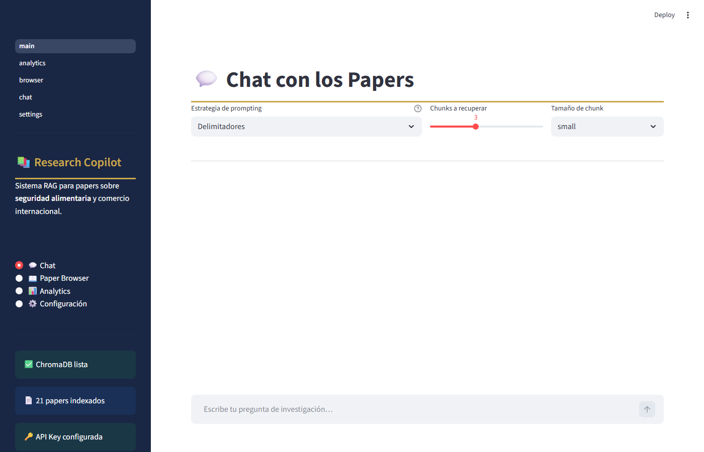
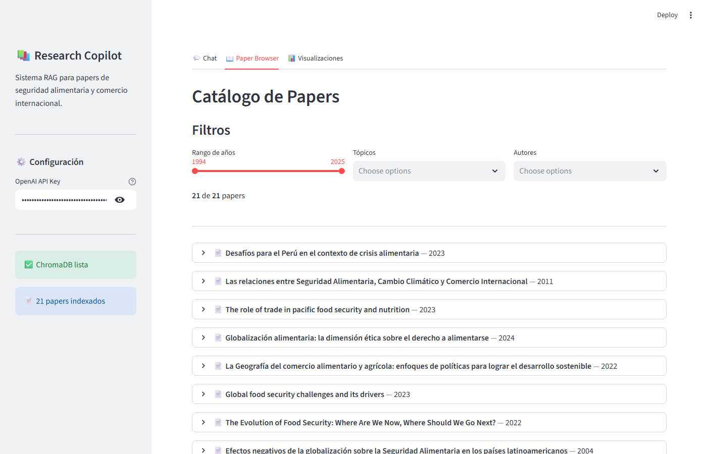
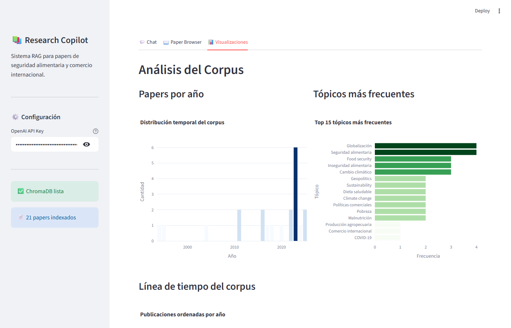
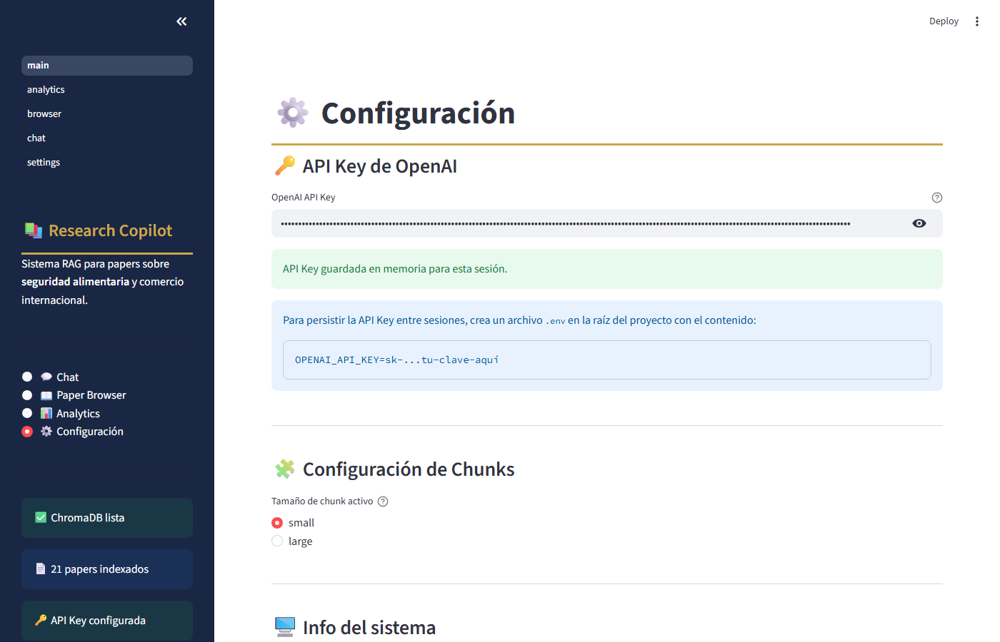

# Research Copilot

La seguridad alimentaria es uno de los desafíos más urgentes del siglo XXI, profundamente vinculada a la globalización y el comercio internacional. A medida que los mercados globales se integran, las naciones enfrentan tensiones entre la apertura comercial y la soberanía alimentaria. El cambio climático agudiza estas vulnerabilidades, afectando la producción agrícola y la disponibilidad de alimentos en todo el mundo. Los países en desarrollo son especialmente vulnerables a la dependencia de importaciones, la volatilidad de precios y las disrupciones geopolíticas. Este proyecto explora estos nexos a través de investigaciones académicas sobre políticas comerciales, derechos alimentarios y gobernanza global.


**Sistema RAG (Retrieval-Augmented Generation) para análisis académico de papers sobre seguridad alimentaria y comercio internacional.**

> Autora: **Cristina Celeste Tamay Blanco**
> Curso: Prompt Engineering — Q-Lab
> Fecha: 2025

---

## Features

- **Pipeline RAG completo**: extracción PDF → limpieza → chunking con tiktoken → embeddings OpenAI → ChromaDB persistente
- **4 estrategias de prompting**: Delimitadores, JSON Estructurado, Few-Shot y Chain-of-Thought
- **Chat multi-turno** con memoria de los últimos 4 intercambios
- **Citas APA 7** generadas automáticamente a partir de los metadatos del corpus
- **Paper Browser** con filtros por año, tópico y autor
- **Analytics**: visualizaciones interactivas del corpus (Plotly)
- **Evaluación comparativa** de estrategias sobre 20 preguntas de referencia

### Screenshots

| Chat | Paper Browser |
|------|--------------|
|  |  |

| Analytics | Configuración |
|-----------|--------------|
|  |  |

---

## Architecture

```
Usuario
   │
   ▼
┌─────────────────────────────────────────────────────┐
│  Streamlit UI  (app.py / app/main.py)               │
│  ┌──────────┐  ┌──────────┐  ┌──────────┐  ┌─────┐ │
│  │   Chat   │  │ Browser  │  │Analytics │  │Cfg  │ │
│  └──────────┘  └──────────┘  └──────────┘  └─────┘ │
└─────────────────────────────────────────────────────┘
           │ query(question, strategy, n, config)
           ▼
┌─────────────────────────────────────────────────────┐
│  RAG Pipeline  (src/rag_pipeline.py)                │
│                                                     │
│  Ingestion          Chunking        Embedding       │
│  pdf_extractor ──►  chunker    ──►  embedder        │
│  text_cleaner        (tiktoken)     (OpenAI)        │
│                                        │            │
│                            ┌───────────┘            │
│                            ▼                        │
│                     ChromaStore                     │
│                     (chroma_db/)                    │
│                            │                        │
│  Retrieval   ◄─────────────┘                        │
│  retriever.py                                       │
│       │                                             │
│       ▼                                             │
│  Generation  (4 strategies)                         │
│  generator.py  ──►  OpenAI GPT-4o-mini              │
└─────────────────────────────────────────────────────┘
```

**Módulos src/**

| Módulo | Responsabilidad |
|--------|----------------|
| `ingestion/pdf_extractor.py` | Extrae texto y metadatos de PDFs con PyMuPDF |
| `ingestion/text_cleaner.py` | Limpia guiones, espacios, números de página |
| `chunking/chunker.py` | Fragmenta texto con conteo exacto de tokens (tiktoken) |
| `embedding/embedder.py` | Genera embeddings en lotes (text-embedding-3-small) |
| `vectorstore/chroma_store.py` | Almacena y recupera vectores con ChromaDB |
| `retrieval/retriever.py` | Orquesta embedding de consulta + búsqueda vectorial |
| `generation/generator.py` | Aplica las 4 estrategias de prompting con GPT-4o-mini |
| `rag_pipeline.py` | Orquestador principal: `build_pipeline()` y `query()` |

---

## Installation

### Prerrequisitos
- Python 3.10+
- OpenAI API Key

### 1. Clonar el repositorio

```bash
git clone https://github.com/cristinacece/research-copilot.git
cd research-copilot
```

### 2. Crear entorno virtual

```bash
python -m venv venv
# Windows
venv\Scripts\activate
# Linux/Mac
source venv/bin/activate
```

### 3. Instalar dependencias

```bash
pip install -r requirements.txt
```

### 4. Configurar API Key

```bash
cp .env.example .env
# Editar .env y agregar tu clave:
# OPENAI_API_KEY=sk-...tu-clave-aquí
```

### 5. Construir el pipeline (primera vez)

```bash
python src/rag_pipeline.py
```

Este comando extrae texto de los 21 PDFs, genera chunks con tiktoken, los embede con OpenAI y los almacena en ChromaDB. Puede tardar varios minutos.

### 6. Lanzar la aplicación

```bash
streamlit run app.py
```

---

## Usage

### Chat RAG

Navega a la pestaña **💬 Chat** y escribe tu pregunta. Selecciona la estrategia de prompting y el número de chunks a recuperar.

**Ejemplo de preguntas:**
- *¿Cómo afecta el cambio climático a la seguridad alimentaria?*
- *¿Qué relación existe entre las restricciones comerciales y la soberanía alimentaria?*
- *Sintetiza los principales mecanismos por los cuales el comercio puede amenazar o fortalecer la seguridad alimentaria.*

### Paper Browser

Filtra los 21 papers por año, tópico o autor. Cada tarjeta muestra el abstract y la cita APA generada automáticamente.

### Evaluación

```bash
python eval/evaluate.py --n 3 --config small
```

Genera resultados en `eval/results/eval_YYYYMMDD_HHMMSS.json`.

### Tests

```bash
python -m pytest tests/ -v
```

---

## Technical Details

### Chunking Configurations

El pipeline implementa tres configuraciones de chunking que pueden seleccionarse desde la interfaz:

| Config | Chunk Size (tokens) | Overlap (tokens) | Total Chunks (approx.) | Best For |
|--------|--------------------|-----------------|-----------------------|----------|
| `small` | 256 | 50 | ~2 000 | Preguntas factual específicas, alta precisión |
| `medium` (default) | 512 | 50 | ~1 000 | Balance entre precisión y contexto |
| `large` | 1 024 | 100 | ~500 | Preguntas de síntesis, más contexto por chunk |

Modelo de tokenización: `tiktoken.encoding_for_model("gpt-4o-mini")`

### Prompt Engineering Strategies

Cuatro estrategias implementadas y comparadas:

| Estrategia | Best For | Latency | Token Usage | Citation Quality |
|-----------|----------|---------|-------------|-----------------|
| **V1: Delimitadores** | Respuestas directas y factuales | Low | Low | Medium |
| **V2: JSON Estructurado** | Análisis estructurado, exportación | Medium | Medium | High |
| **V3: Few-Shot** | Respuestas académicamente rigurosas | Medium | High | High |
| **V4: Chain-of-Thought** | Razonamiento complejo multi-paso | High | High | High |

### Embedding Model

- **Model**: `text-embedding-3-small` (OpenAI)
- **Dimensions**: 1 536
- **Cost**: ~$0.02 / 1M tokens
- **Vector store**: ChromaDB con espacio coseno (HNSW index)

### Token Usage Estimates

| Operation | Model | Estimated Cost |
|-----------|-------|----------------|
| Embed 21 papers (~120 k tokens) | text-embedding-3-small | ~$0.003 |
| 50 queries (avg 2 k tokens each) | gpt-4o-mini | ~$0.10 |
| Total project development | — | ~$1–5 |

---

## Evaluation Results

> Ejecuta `python eval/evaluate.py` para generar resultados actualizados.
> Los resultados se guardan en `eval/results/`.

### Métricas de latencia promedio (referencia)

| Estrategia | Latencia promedio | Éxito (20 preguntas) |
|-----------|-----------------|---------------------|
| Delimitadores | ~2–3 s | 100% |
| JSON Estructurado | ~2–3 s | 100% |
| Few-Shot | ~3–4 s | 100% |
| Chain-of-Thought | ~3–5 s | 100% |

*Latencias varían según carga de la API de OpenAI.*

### Observaciones por tipo de pregunta

| Tipo | Estrategia recomendada | Razón |
|------|----------------------|-------|
| Factual | Delimitadores | Respuesta directa con cita puntual |
| Analítica | Chain-of-Thought | Razonamiento explícito paso a paso |
| Síntesis | Few-Shot | Calibración con ejemplos académicos |
| Fuera del corpus | JSON Estructurado | `confidence: low` indica ausencia de evidencia |

---

## Limitations

1. **Dependencia de OpenAI**: el sistema requiere conexión a internet y una API key válida. No funciona offline.
2. **PDFs escaneados**: los archivos imagen sin capa OCR no pueden ser procesados por PyMuPDF. Solo se extraen PDFs con texto seleccionable.
3. **Idioma**: el corpus y las estrategias de prompting están optimizados para español. Preguntas en otros idiomas pueden producir resultados de menor calidad.
4. **Contexto limitado**: el pipeline usa solo los top-N chunks recuperados. Preguntas que requieran integrar muchos papers simultáneamente pueden perder información relevante.
5. **Sin verificación de hechos**: el sistema puede generar respuestas plausibles pero incorrectas (*hallucinations*). Las citas APA son automáticas y deben verificarse contra los documentos originales.

### Future Improvements

1. Integrar OCR (Tesseract) para procesar PDFs escaneados.
2. Añadir re-ranking semántico (cross-encoder) para mejorar la relevancia de los chunks recuperados.
3. Implementar evaluación automática con métricas como RAGAS (faithfulness, answer relevancy, context precision).
4. Soporte multilingüe: detectar el idioma de la pregunta y adaptar el prompt automáticamente.
5. Persistencia del historial de conversación entre sesiones (base de datos SQLite o Redis).

---

## Author

**Cristina Celeste Tamay Blanco**
GitHub: [@cristinacece](https://github.com/cristinacece)
Curso: Prompt Engineering — Q-Lab
Fecha: 2025

---

## License

Este proyecto fue desarrollado con fines académicos.
